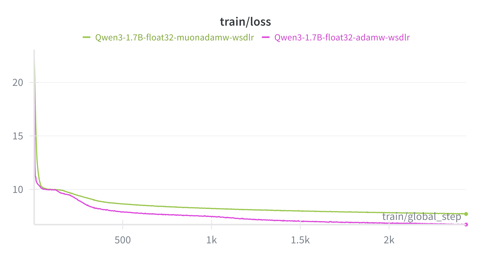
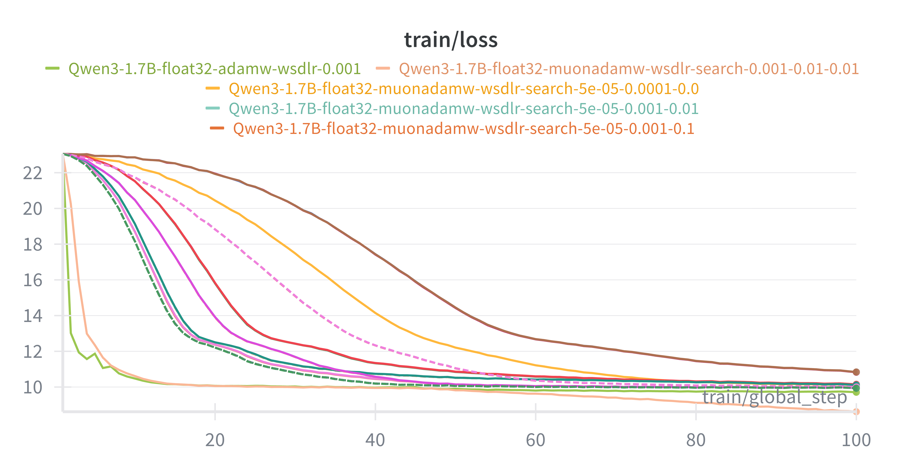

# Multilingual-TTS

Building actual open source including dataset multilingual TTS more than 150 languages with Voice Cloning based on [Neucodec](https://github.com/neuphonic/neucodec) as speech tokenizer, 50 TPS.

## Release

| Model | Link | Purpose |
|---|---|---|
| Multilingual-TTS-0.6B-Base | [🤗](https://huggingface.co/Scicom-intl/Multilingual-TTS-0.6B-Base) | Base |
| Multilingual-TTS-1.7B-Base | [🤗](https://huggingface.co/Scicom-intl/Multilingual-TTS-1.7B-Base) | Base |
| Multilingual-TTS-4B-Base | [🤗](https://huggingface.co/Scicom-intl/Multilingual-TTS-4B-Base) | Base |

## Dataset 

### Base

#### Source

1. https://huggingface.co/datasets/malaysia-ai/Multilingual-TTS
2. https://huggingface.co/datasets/Scicom-intl/Emilia-YODAS-Voice-Conversion
3. https://huggingface.co/datasets/Scicom-intl/Malaysian-Emilia

#### Size

1. Multi-speaker multilingual Voice Cloning, **up to 35.88B tokens**.
2. Multi-speaker multilingual TTS more than 150 languages, **up to 14.64B tokens**.

#### Preparation

All steps to reproduce in [preparation](preparation).

### Expressive TTS

#### Size

#### Preparation

All steps to reproduce in [synthetic-description](synthetic-description).

## Ablation

### One Epoch

1. Use approximate of 10240 * 256 * 8 GPUs global token size, ~20,971,520 tokens.
2. Warmup step is 100.
3. FP32-BF16 Mixed precision.
4. Compare AdamW with WSD learning rate, Muon + AdamW with WSD learning rate, where WSD number decay step is 10% of the dataset.
5. Only done on Qwen3 1.7B Base.
6. AdamW performed better.

### Hyperparameter search

But we not satisfied with one epoch ablation due to learning rates are not aggressive enough.

1. Use approximate of 10240 * 256 * 8 GPUs global token size, ~20,971,520 tokens.
2. 100 steps only.
3. Warmup step is 50.
4. FP32-BF16 Mixed precision.
5. Only done on Qwen3 1.7B Base.
6. Permute search on LR for AdamW, LR for Muon and decay rate, [hyperparameter_search.py](hyperparameter_search.py)
7. We run aggresive LR, [hyperparameter_search_extra.py](hyperparameter_search_extra.py), turns out its the best.
8. We compare using AdamW only using the same aggresive LR as (6), [1.7B-adamw-aggresive.sh](1.7B-adamw-aggresive.sh).
9. Adding Muon performed better.

## WanDB

All experiments at https://wandb.ai/aies-scicom-scicom-ai/Multilingual-TTS

## Acknowledgement

1. Thanks to [Malaysia-AI](https://huggingface.co/malaysia-ai) for gathering huge dataset for TTS, https://huggingface.co/datasets/malaysia-ai/Multilingual-TTS
2. Thanks to [Scitix](https://www.scitix.ai/) for H100 node access!