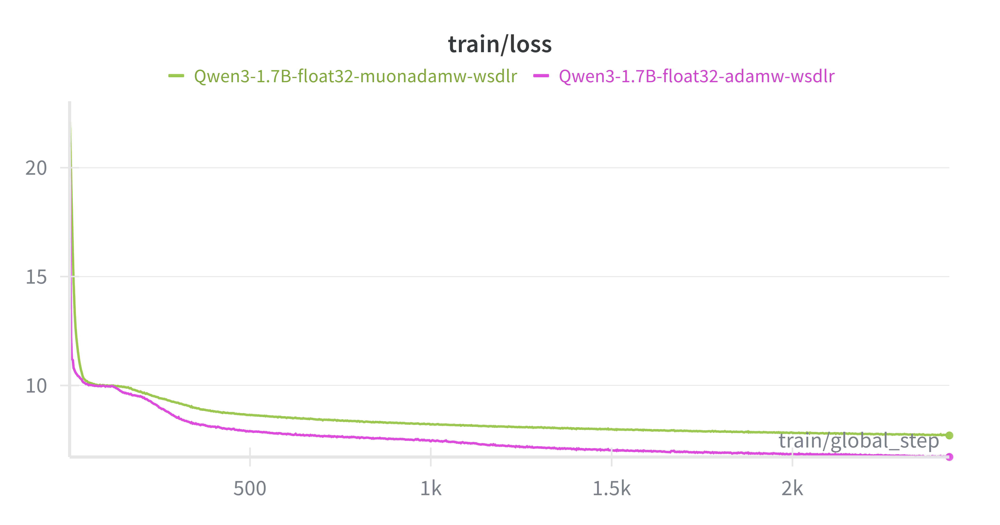
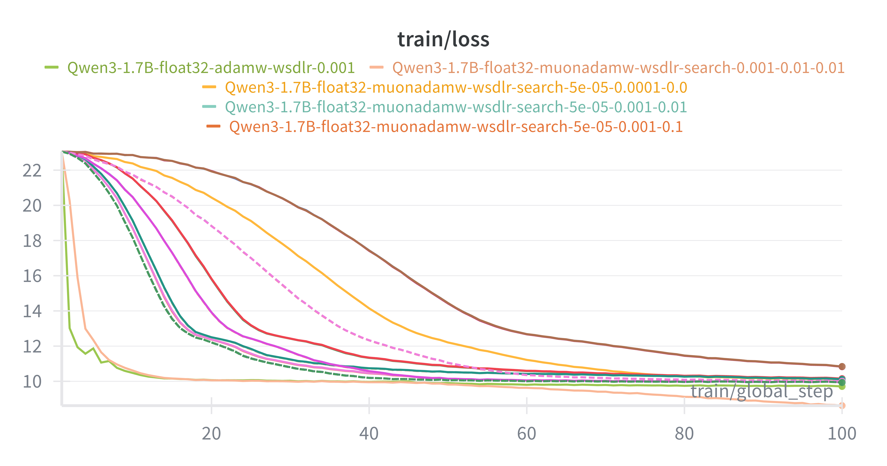

# Multilingual-TTS

Open-source multilingual TTS with Voice Cloning support for 150+ languages, built on [Neucodec](https://github.com/neuphonic/neucodec) as the speech tokenizer at 50 TPS.

## Models

| Model | Link | Purpose |
|---|---|---|
| Multilingual-TTS-0.6B-Base | [🤗](https://huggingface.co/Scicom-intl/Multilingual-TTS-0.6B-Base) | Base |
| Multilingual-TTS-1.7B-Base | [🤗](https://huggingface.co/Scicom-intl/Multilingual-TTS-1.7B-Base) | Base |
| Multilingual-Expressive-TTS-0.6B | [🤗](https://huggingface.co/Scicom-intl/Multilingual-Expressive-TTS-0.6B) | Post-training TTS |
| Multilingual-Expressive-TTS-1.7B | [🤗](https://huggingface.co/Scicom-intl/Multilingual-Expressive-TTS-1.7B) | Post-training TTS |

## Evaluation

### [TTS Evaluation](tts-evaluation/README.md)

CER and MOS across 76 languages, compared against: Dia TTS, Orpheus, Chatterbox (23 languages), Fish Audio S2 Pro, Qwen3 TTS (11 languages).

| Model | Languages | CER ↓ | MOS ↑ |
|-------|:---------:|:-----:|:-----:|
| Dia TTS | 76 | 0.8131 | 1.8575 |
| Multilingual TTS 0.6B | 76 | 0.2384 | 3.2273 |
| Multilingual TTS 1.7B | 76 | **0.2362** | **3.2330** |
| Orpheus | 76 | 0.6075 | 2.7267 |
| Chatterbox | 23 | 0.1698 | 2.8405 |
| Fish Audio S2 Pro | 76 | 0.2370 | 2.9698 |
| Qwen3 TTS | 11 | **0.1064** | 2.6073 |

> Chatterbox covers 23 languages only; Qwen3 TTS covers 11 languages only. Their averages are not directly comparable to 76-language models.

### [VC Evaluation](vc-evaluation/README.md)

Speaker similarity and CER across 76 languages, compared against: Dia TTS, Orpheus, Chatterbox (23 languages), Fish Audio S2 Pro.

| Model | Languages | Similarity ↑ | CER ↓ |
|-------|:---------:|:------------:|:-----:|
| Dia TTS | 76 | 0.3416 | 0.6867 |
| Multilingual TTS 0.6B | 76 | 0.5051 | 0.2733 |
| Multilingual TTS 1.7B | 76 | **0.5036** | 0.2656 |
| Orpheus | 76 | 0.4002 | 0.6771 |
| Chatterbox | 23 | **0.6704** | **0.1099** |
| Fish Audio S2 Pro | 76 | 0.6097 | **0.2283** |

> Chatterbox covers 23 languages only; its averages are not directly comparable to 76-language models.

## Dataset

### Base

**Sources**

1. https://huggingface.co/datasets/malaysia-ai/Multilingual-TTS
2. https://huggingface.co/datasets/Scicom-intl/Emilia-YODAS-Voice-Conversion
3. https://huggingface.co/datasets/Scicom-intl/Malaysian-Emilia

**Size**

1. Multi-speaker multilingual Voice Cloning — **up to 35.88B tokens**
2. Multi-speaker multilingual TTS, 150+ languages — **up to 25.35B tokens**

**Preparation:** [preparation](preparation)

### Expressive TTS

Natural-language descriptions of speech audio generated by computing acoustic statistics and categories, then prompting an LLM to summarise them.

**Sources**

1. https://huggingface.co/datasets/Scicom-intl/ExpressiveSpeech

**Size**

1. Multi-speaker multilingual Expressive TTS — **up to 1.15B tokens**

**Pipeline**

```
audio + transcript
      │
      ▼
speech_categories.py   ← categories (emotion, gender, fluency, accent, quality)
      │                   speech_stats_func  ← pitch, SNR, speaking rate, SQUIM
      ▼
calculate_bins.py      ← bin continuous stats, merge into a single parquet
      │
      ▼
synthetic.py           ← LLM generates a natural-language description per row
```

Uses [Qwen/Qwen2.5-72B-Instruct](https://deepinfra.com/Qwen/Qwen2.5-72B-Instruct) via DeepInfra by default. Any OpenAI-compatible endpoint works — set `API_KEY`, `BASE_URL`, and `MODEL_NAME`.

**Preparation:** [synthetic-description](synthetic-description)

## Ablation

### One Epoch

1. Global token size: 10240 × 256 × 8 GPUs ≈ 20,971,520 tokens
2. Warmup: 100 steps
3. FP32-BF16 mixed precision
4. Compared AdamW with WSD LR vs Muon + AdamW with WSD LR (decay = 10% of dataset)
5. Run on Qwen3 1.7B Base only
6. **AdamW performed better**



### Hyperparameter Search

One-epoch results used conservative learning rates, so we ran a focused search:

1. Global token size: 10240 × 256 × 8 GPUs ≈ 20,971,520 tokens
2. 100 steps, warmup 50 steps
3. FP32-BF16 mixed precision
4. Run on Qwen3 1.7B Base only
5. Grid search over AdamW LR, Muon LR, and decay rate — [hyperparameter_search.py](hyperparameter_search.py)
6. Aggressive LR sweep — [hyperparameter_search_extra.py](hyperparameter_search_extra.py) — turned out best
7. AdamW-only with the same aggressive LR — [1.7B-adamw-aggresive.sh](1.7B-adamw-aggresive.sh)
8. **Adding Muon performed better**



## Training

### Base

```bash
# 0.6B
bash 0.6B.sh

# 1.7B
bash 1.7B.sh
```

### Expressive TTS

```bash
# 0.6B
bash 0.6B-expressive.sh

# 1.7B
bash 1.7B-expressive.sh
```

## WandB

- Base experiments: https://wandb.ai/aies-scicom-scicom-ai/Multilingual-TTS
- Post TTS experiments: https://wandb.ai/aies-scicom-scicom-ai/Multilingual-TTS-Expressive

## Optimize Inference

For better concurrency, you can use https://github.com/Scicom-AI-Enterprise-Organization/TTS-API-Neucodec

## Acknowledgements

1. [Malaysia-AI](https://huggingface.co/malaysia-ai) for the large-scale TTS dataset: https://huggingface.co/datasets/malaysia-ai/Multilingual-TTS
2. [Scitix](https://www.scitix.ai/) for H100 node access
